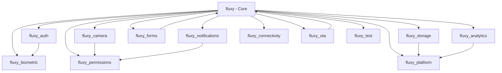

# Modular Packages (v1.0.0)

Fluxy v1.0.0 introduces a **modular architecture** that splits the monolithic framework into focused packages. Install only the features you need for faster builds and smaller apps.

## 📦 Available Packages

### Core Framework (Required)
```yaml
dependencies:
  fluxy: ^1.0.0  # 172KB - Essential UI framework, DSL, and reactive system
```

**Includes:**
- Reactive state management (`flux`, `FluxComputed`, `AsyncFlux`)
- Atomic styling DSL (`Fx.text`, `.bg()`, `.padding()`, etc.)
- Stability Kernel™ (auto-repair, error handling)
- Basic routing and navigation
- Core widgets and components

---

## 🚀 Platform Modules

### fluxy_auth
**Authentication & Biometrics**
```yaml
dependencies:
  fluxy_auth: ^1.0.0
```

**Features:**
- Email/password authentication
- Biometric authentication (fingerprint, face ID)
- Session management
- JWT token handling
- Social auth integration

**Usage:**
```dart
import 'package:fluxy_auth/fluxy_auth.dart';

// Sign in
final result = await Fx.platform.auth.signIn(
  email: 'user@example.com',
  password: 'password123'
);

// Biometric auth
final isAuth = await Fx.platform.biometric.authenticate();

// Get current user
final user = Fx.platform.auth.currentUser;
```

### fluxy_camera
**Camera Functionality**
```yaml
dependencies:
  fluxy_camera: ^1.0.0
```

**Features:**
- Camera capture (photo/video)
- Gallery picker
- Image preview and editing
- Flash control
- Front/back camera switching

**Usage:**
```dart
import 'package:fluxy_camera/fluxy_camera.dart';

// Take photo
final image = await Fx.platform.camera.capture();

// Pick from gallery
final image = await Fx.platform.camera.pickFromGallery();

// Preview camera
await Fx.platform.camera.preview(context);
```

### fluxy_notifications
**Push Notifications**
```yaml
dependencies:
  fluxy_notifications: ^1.0.0
```

**Features:**
- Local notifications
- Push notification handling
- Scheduled notifications
- Permission management
- Android 13+ compatibility

**Usage:**
```dart
import 'package:fluxy_notifications/fluxy_notifications.dart';

// Request permission
await Fx.platform.notifications.requestPermission();

// Show notification
await Fx.platform.notifications.show(
  title: 'Hello',
  body: 'Fluxy notification!',
  payload: 'custom_data'
);

// Schedule notification
await Fx.platform.notifications.schedule(
  title: 'Reminder',
  body: 'Don\'t forget!',
  scheduledDate: DateTime.now().add(Duration(hours: 1))
);
```

### fluxy_storage
**Data Persistence**
```yaml
dependencies:
  fluxy_storage: ^1.0.0
```

**Features:**
- Key-value storage
- Secure storage (encrypted)
- Cache management
- Data synchronization
- Cross-platform compatibility

**Usage:**
```dart
import 'package:fluxy_storage/fluxy_storage.dart';

// Standard storage
await Fx.platform.storage.set('username', 'john_doe');
final username = await Fx.platform.storage.get('username');

// Secure storage
await Fx.platform.storage.setSecure('api_key', 'secret_key');
final apiKey = await Fx.platform.storage.getSecure('api_key');

// Clear storage
await Fx.platform.storage.clear();
```

### fluxy_forms
**Forms & Validation**
```yaml
dependencies:
  fluxy_forms: ^1.0.0
```

**Features:**
- Form validation
- Input field components
- Form submission handling
- Real-time validation
- Custom validators

**Usage:**
```dart
import 'package:fluxy_forms/fluxy_forms.dart';

class LoginForm extends StatelessWidget {
  final email = flux('');
  final password = flux('');
  final formKey = fluxy.FormKey();

  @override
  Widget build(BuildContext context) {
    return Fx.form(
      key: formKey,
      child: Fx.col([
        Fx.input.email(
          signal: email,
          placeholder: 'Email address',
          validator: Validators.email,
        ),
        Fx.input.password(
          signal: password,
          placeholder: 'Password',
          validator: Validators.password,
        ),
        Fx.button('Login')
          .primary
          .onTap(() => _submit())
      ]).gap(3),
    );
  }

  void _submit() {
    if (formKey.currentState!.validate()) {
      // Form is valid
    }
  }
}
```

### fluxy_analytics
**Analytics & Tracking**
```yaml
dependencies:
  fluxy_analytics: ^1.0.0
```

**Features:**
- Event tracking
- User analytics
- Custom events
- Screen tracking
- Privacy controls

**Usage:**
```dart
import 'package:fluxy_analytics/fluxy_analytics.dart';

// Track event
await Fx.platform.analytics.track('button_clicked', {
  'button_name': 'login',
  'screen': 'login_page'
});

// Track screen
await Fx.platform.analytics.trackScreen('dashboard');

// Set user properties
await Fx.platform.analytics.setUserProperty('premium_user', true);
```

### fluxy_biometric
**Biometric Authentication**
```yaml
dependencies:
  fluxy_biometric: ^1.0.0
```

**Features:**
- Fingerprint authentication
- Face ID authentication
- Biometric availability check
- Custom authentication UI
- Security level configuration

**Usage:**
```dart
import 'package:fluxy_biometric/fluxy_biometric.dart';

// Check availability
final isAvailable = await Fx.platform.biometric.isAvailable;

// Authenticate
final result = await Fx.platform.biometric.authenticate(
  reason: 'Authenticate to access secure data',
  options: BiometricOptions(
    useErrorDialogs: true,
    stickyAuth: true,
  )
);
```

### fluxy_connectivity
**Network Connectivity**
```yaml
dependencies:
  fluxy_connectivity: ^1.0.0
```

**Features:**
- Network status monitoring
- Connection type detection
- Offline/online handling
- Reactive connectivity state
- Custom connectivity handlers

**Usage:**
```dart
import 'package:fluxy_connectivity/fluxy_connectivity.dart';

// Check connectivity
final isConnected = Fx.platform.connectivity.isConnected;

// Listen to connectivity changes
Fx.platform.connectivity.onChanged.listen((status) {
  print('Connectivity changed: $status');
});

// Get connection type
final type = await Fx.platform.connectivity.connectionType;
```

### fluxy_permissions
**Device Permissions**
```yaml
dependencies:
  fluxy_permissions: ^1.0.0
```

**Features:**
- Permission requests
- Permission status checking
- Multiple permission handling
- Custom permission dialogs
- Platform-specific permissions

**Usage:**
```dart
import 'package:fluxy_permissions/fluxy_permissions.dart';

// Request camera permission
final status = await Fx.platform.permissions.request(
  Permission.camera
);

// Check permission status
final isGranted = await Fx.platform.permissions.isGranted(
  Permission.camera
);

// Request multiple permissions
final results = await Fx.platform.permissions.requestMultiple([
  Permission.camera,
  Permission.microphone,
  Permission.storage,
]);
```

### fluxy_platform
**Platform Integration**
```yaml
dependencies:
  fluxy_platform: ^1.0.0
```

**Features:**
- Platform detection
- Device information
- System settings
- Platform-specific APIs
- Cross-platform utilities

**Usage:**
```dart
import 'package:fluxy_platform/fluxy_platform.dart';

// Get platform info
final platform = Fx.platform.info;
print('Platform: ${platform.operatingSystem}');
print('Version: ${platform.version}');

// Open settings
await Fx.platform.settings.openAppSettings();

// Get device info
final device = await Fx.platform.device.getInfo();
```

### fluxy_ota
**Over-the-Air Updates** [EXPERIMENTAL]
```yaml
dependencies:
  fluxy_ota: ^1.0.0
```

**Features:**
- Remote configuration updates
- Dynamic styling changes
- Server-driven UI
- Manifest-based updates
- Experimental features

**Usage:**
```dart
import 'package:fluxy_ota/fluxy_ota.dart';

// Enable OTA updates
await Fx.platform.ota.enable();

// Check for updates
final hasUpdate = await Fx.platform.ota.checkForUpdates();

// Apply remote configuration
await Fx.platform.ota.applyRemoteConfig();
```

### fluxy_test
**Testing Utilities**
```yaml
dependencies:
  fluxy_test: ^1.0.0
```

**Features:**
- Testing utilities
- Mock providers
- Test helpers
- Widget testing support
- Integration testing tools

**Usage:**
```dart
import 'package:fluxy_test/fluxy_test.dart';

void main() {
  testWidgets('MyWidget test', (tester) async {
    // Test with Fluxy
    await tester.pumpWidget(
      FluxyTestApp(
        child: MyWidget(),
      ),
    );
    
    // Test flux state
    expect(find.text('Hello'), findsOneWidget);
  });
}
```

---

## 🏗️ Package Dependencies

Some packages have dependencies on others:



---

## 📋 Installation Examples

### Minimal App (Core Only)
```yaml
dependencies:
  fluxy: ^1.0.0
```

### Social Media App
```yaml
dependencies:
  fluxy: ^1.0.0
  fluxy_auth: ^1.0.0
  fluxy_camera: ^1.0.0
  fluxy_storage: ^1.0.0
  fluxy_notifications: ^1.0.0
  fluxy_forms: ^1.0.0
```

### Enterprise App
```yaml
dependencies:
  fluxy: ^1.0.0
  fluxy_auth: ^1.0.0
  fluxy_biometric: ^1.0.0
  fluxy_storage: ^1.0.0
  fluxy_analytics: ^1.0.0
  fluxy_permissions: ^1.0.0
  fluxy_platform: ^1.0.0
  fluxy_test: ^1.0.0
```

### Full-Featured App
```yaml
dependencies:
  fluxy: ^1.0.0
  fluxy_auth: ^1.0.0
  fluxy_camera: ^1.0.0
  fluxy_notifications: ^1.0.0
  fluxy_storage: ^1.0.0
  fluxy_forms: ^1.0.0
  fluxy_analytics: ^1.0.0
  fluxy_biometric: ^1.0.0
  fluxy_connectivity: ^1.0.0
  fluxy_permissions: ^1.0.0
  fluxy_platform: ^1.0.0
  fluxy_ota: ^1.0.0
  fluxy_test: ^1.0.0
```

---

## 🔄 Migration from Monolithic

If you're upgrading from v0.2.6, check which features you use and add the corresponding packages:

```dart
// v0.2.6 (monolithic)
import 'package:fluxy/fluxy.dart';

// v1.0.0 (modular)
import 'package:fluxy/fluxy.dart';
import 'package:fluxy_auth/fluxy_auth.dart';    // If using auth
import 'package:fluxy_camera/fluxy_camera.dart';  // If using camera
import 'package:fluxy_storage/fluxy_storage.dart'; // If using storage
// ... add other modules as needed
```

---

## 🎯 Benefits

### 1. Smaller Bundle Size
- **Core Only**: 172KB vs 15MB+ monolithic
- **Selective**: Only download features you use
- **Faster Builds**: Less code to compile

### 2. Better Performance
- **Tree Shaking**: Unused code eliminated
- **Faster Installation**: Smaller dependencies
- **Reduced Memory**: Only loaded modules in memory

### 3. Flexible Development
- **Incremental Adoption**: Add features as needed
- **Independent Updates**: Each module evolves separately
- **Custom Combinations**: Mix and match features

### 4. Better Maintenance
- **Clear Boundaries**: Each package has single responsibility
- **Focused Development**: Smaller codebases to maintain
- **Easier Testing**: Isolated module testing

---

## 📞 Need Help?

- **[Migration Guide](/docs/migration/migration-1-0-0)**: Complete upgrade instructions
- **[Installation Guide](/docs/installation)**: Step-by-step setup
- **[Examples](https://github.com/swaingithub/fluxy/tree/main/example)**: Sample projects
- **[Issues](https://github.com/swaingithub/fluxy/issues)**: Report problems
- **[Discussions](https://github.com/swaingithub/fluxy/discussions)**: Ask questions
