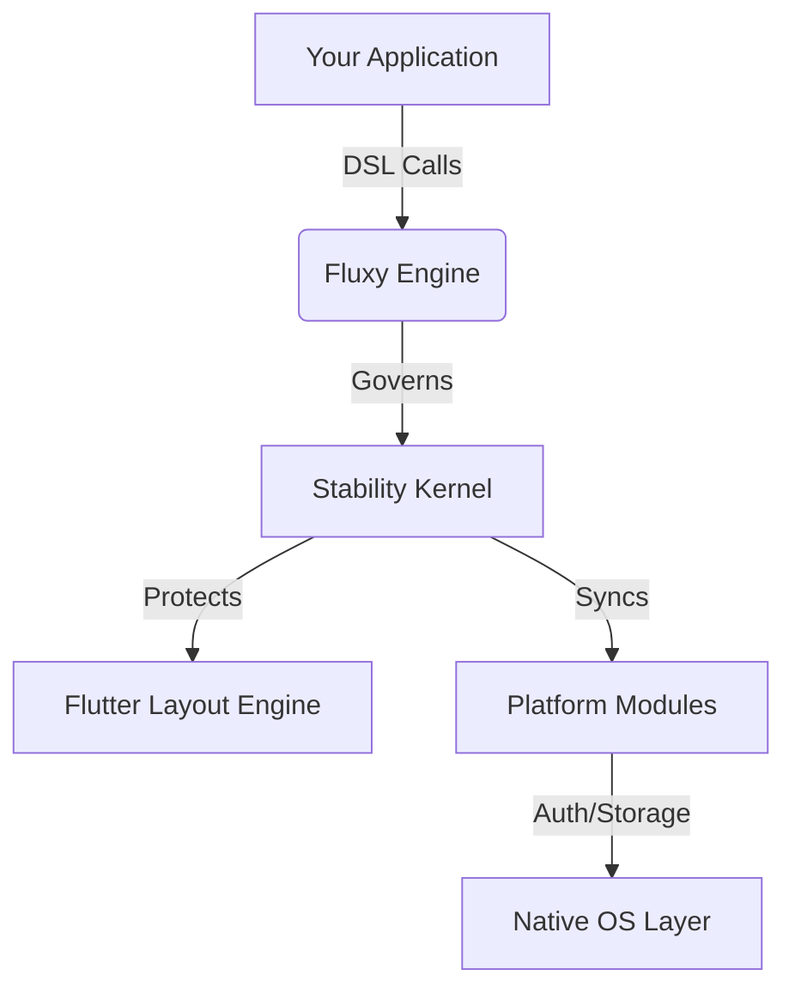

# In-depth Analysis

Fluxy is not just a UI toolkit; it is a **Managed Runtime Environment** for Flutter. This analysis explores the core engineering decisions that enable its high-performance, reactive, and stable nature.

## 1. The Managed Runtime Architecture

Fluxy operates as a "Stability Kernel" sitting between your application code and the Flutter Framework. This architecture ensures that the framework can proactively prevent common Flutter pitfalls (like layout overflows or infinite constraints) before they crash the app.

### The Governance Layers:
1.  **Safety Sandbox**: Blocks invalid layout combinations (e.g., using `wFull()` inside a horizontal `FxScroll`).
2.  **Kernel Layer**: Manages the lifecycle of global modules like `Auth`, `Storage`, and `Connectivity`.
3.  **Reactive Core**: A high-efficiency signal graph that executes with $O(1)$ complexity for dependency resolution.



---

## 2. Structural Performance: Attribute Accumulation

Traditional Flutter development often results in "Nested Wrapper Bloat" (e.g., `Padding > DecoratedBox > Opacity > Transform`). This increases the depth of the element tree and slows down layout passes.

Fluxy solves this through **Attribute Accumulation**. When you chain modifiers:

```dart
Fx.box()
  .px(20)
  .bg(Colors.blue)
  .rounded(12)
  .opacity(0.8)
```

The engine does **not** create four separate widgets. Instead, it accumulates these properties into a single `FxStyle` object. The `Box` widget then renders these attributes in a single paint pass using the `FxDecorationBuilder`.

**Result**: A 60-80% reduction in widget depth for complex UI components.

---

## 3. High-Scale Reactivity: The "Holy Trinity"

For large-scale applications, simple signals aren't enough. Fluxy introduces advanced primitives to handle data complexity and heavy workloads.

### I. `fluxSelector` (Targeted Rebuilds)
This solves the performance bottleneck of "over-rebuilding." By using a selector, you can bind a widget to a specific property of a large object.

```dart
// Only rebuilds if the specific 'name' property changes.
Fx(() => Fx.text(Fx.auth.user.selector((u) => u.name)))
```

### II. `fluxWorker` (Multi-threaded Logic)
Flutter runs on a single UI thread. Heavy math (like crypto price analysis or complex JSON parsing) can cause "jank." `fluxWorker` automatically moves this work to a background **Dart Isolate** while keeping the reactive API simple.

### III. `batch()` (Atomic Synchronicity)
Prevents intermediate UI "flickering" during multiple state updates by grouping them into a single micro-task flush.

---

## 4. The "Single Engine" Philosophy

In most Flutter architectures, Auth, Routing, and Networking are disjointed libraries. In Fluxy, they are **Unified**.

*   **Auth + Networking**: When `Fx.auth` authenticates a user, it automatically signals the `FluxyHttp` engine via a managed interceptor to inject the token.
*   **Routing + DI**: When `FluxyRouter` navigates, it automatically initializes and disposes of `FluxController` instances based on their scope.
*   **Storage + State**: Setting `persist: true` on a `flux()` automatically binds it to the secure storage kernel with hash-based checksums for data integrity.

---

## 5. Layout Guard & Stability

Fluxy is "Layout Aware." it uses **Structural Recursion** to detect if a widget's constraints will cause a crash.

If you attempt to apply an infinite constraint inside a scrollable viewport, Fluxy catches it:
1.  **Alerts**: During development, it shows a "Layout Alert" overlay.
2.  **Fallback**: In production, it safe-guards the constraint to the parent's maximum bounds to prevent a "white screen of death."

---

## 6. Common Gotchas & Advanced Stability

Even with a stability kernel, certain Flutter-native behaviors can cause issues if not managed through Fluxy patterns.

### The "Navigator Lock" (`!_debugLocked`)
**The Problem**: Attempting to push a dialog or navigate from a global signal listener (like `Fx.auth`) can trigger a Flutter assertion error if multiple rebuilds or listeners fire at the exact same microtask.

**The Solution (The Fluxy Way)**:
1.  **Route-Managed Lifecycle**: Never `put()` a controller inside a `StatelessWidget`. Define it in your `FxRoute`:
    ```dart
    FxRoute(
      path: '/hub',
      builder: (ctx, args) => HubView(),
      controller: () => HubController(), // Auto-managed
    )
    ```
2.  **Dialog Guards**: Use a boolean flag (e.g., `_isDialogShowing`) in your controller to prevent "signal flooding" from opening multiple concurrent overlays.
3.  **Post-Frame Execution**: Always wrap global navigation calls in `WidgetsBinding.instance.addPostFrameCallback` to ensure the framework is in a stable state.

### Listener Duplication
If a controller is re-instantiated during a hot-reload or a parent rebuild, its `onInit` listeners might double up. 
*   **Fix**: Use the `FluxEffect` tracking pattern. Store all listeners in a `List<FluxEffect>` and clear them in `onDispose()`.

---

## Summary for Architects

Fluxy's engineering goal is to provide **Industrial-Grade Safety** with **Consumer-Grade Simplicity**. By moving logic out of the Widget Tree and into a managed Reactive Graph, it enables a level of stability and performance that is difficult to achieve with manual Flutter implementation.
